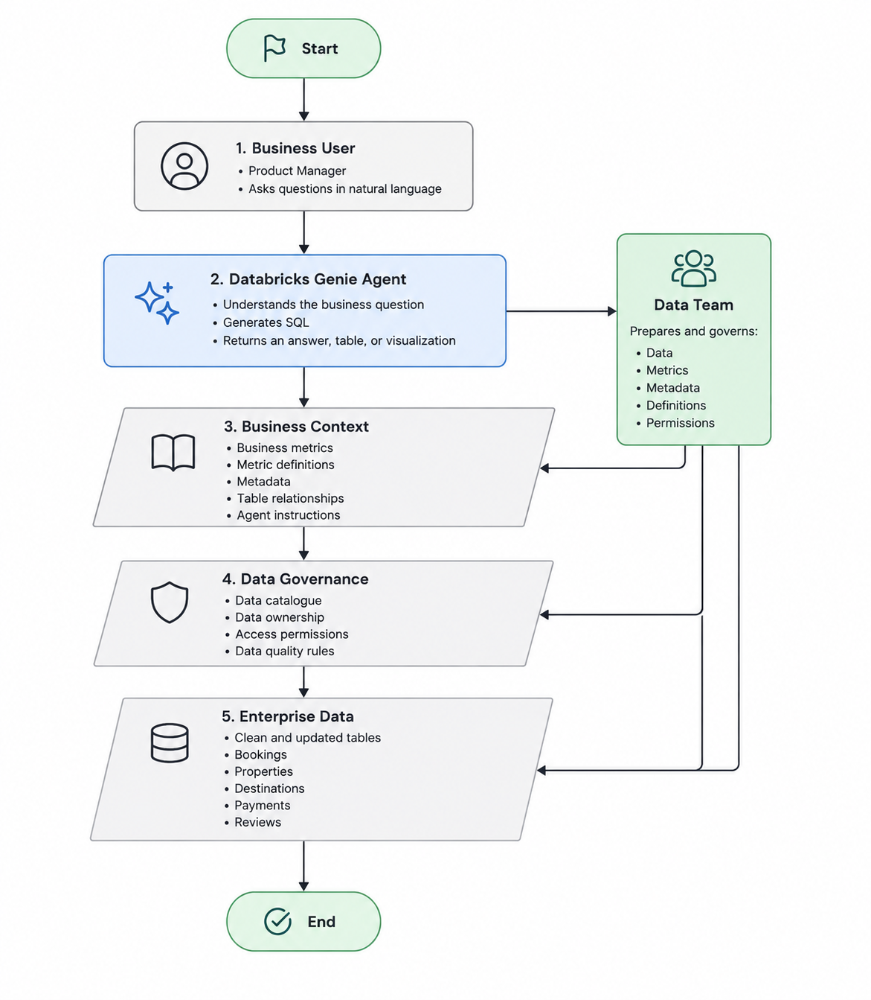

# Databricks Genie Agents Product Context

## Objective

In this document I will establishe what Databricks Genie Agents are, who uses them, and the user problem they address. I will define the main teardown question, hypothesis, evaluation areas, Wanderbricks business scenario, and where the agent fits within the broader data product.

## 1. Workspace status

- GitHub repository created.
- Databricks Free Edition workspace created.
- Wanderbricks sample data explored.
- Initial dataset tables selected.

## 2. Understanding the product

| Question | Beginner-friendly answer |
| --- | --- |
| Who uses Databricks Genie Agents? | Business users who understand the company but may not write SQL, such as product, finance, sales, or operations teams. Data analysts or domain experts configure the agent. |
| What problem does the product solve? | It lets business users ask questions about company data without waiting for an analyst to create every query or report. |
| What data does it need? | Relevant company tables or views, plus clear names and descriptions that explain what the data means. |
| What does a business user ask it? | Questions such as “Which destination had the most bookings?” or “Why did cancellations increase?” |
| How does it generate an answer? | It interprets the question, selects relevant data, generates and runs SQL, then returns an answer, table, or visualization. |
| How does it differ from a dashboard? | A dashboard answers prepared questions through predefined charts. A Genie Agent supports new and follow-up questions in natural language. |
| What must the data team configure? | A clear data catalogue containing tables, columns, relationships, business definitions, and metadata. |
| Where could the product fail? | Failures can come from outdated, incomplete, duplicated, poorly cleaned, or badly described data; wrong joins, filters, metrics, or date periods; and misunderstood business terms. |

Source: [Databricks documentation](https://docs.databricks.com/aws/en/genie/monitor)

## 3. Simple product flow

The related [product map](../research/product-map.md) shows the same high-level flow.

```text
Business user
  ↓
Natural-language question
  ↓
Genie Agent
  ↓
Business definitions and instructions
  ↓
Governed company data
  ↓
Generated SQL
  ↓
Answer, table, or visualization
```

## 4. Target user

Primary user: Product Manager or business manager who understands the business but does not regularly write SQL.

This user wants faster answers without waiting for a data analyst.

## 5. Current analytics workflow

The current workflow, drawn from the [product brief](../research/product-brief.md), is:

1. The Product Manager notices a change in a dashboard.
2. They want to understand why it happened.
3. The existing dashboard does not provide enough detail.
4. They ask a data analyst for help.
5. The analyst translates the business question into SQL.
6. The analyst checks the metric definitions and data quality.
7. The Product Manager receives the answer hours or days later.
8. Follow-up questions restart the process.

This creates delays and makes follow-up questions dependent on the data team.

## 6. User frustrations

- Waiting for data analysts
- Limited dashboard flexibility
- Difficulty asking follow-up questions
- Inconsistent metric definitions
- Low confidence in AI-generated answers
- Difficulty knowing which data was used
- Dependence on technical teams

## 7. Job to be done

When business performance changes, I want to investigate governed business data using natural language so that I can make informed decisions quickly and trust the answers I receive.

## 8. Main teardown question

Can Databricks Genie Agents help Product Managers investigate business data faster while still providing reliable answers based on well-governed enterprise data?

All later work should help answer this question.

## 9. Hypothesis

Databricks Genie Agents can reduce the time Product Managers spend waiting for analysts, but the reliability of their answers depends on clear business definitions, accurate and updated data, strong metadata, and proper data governance.

## 10. Evaluation areas

| Area | What it evaluates |
| --- | --- |
| Time to insight | Whether users can reach useful answers more quickly. |
| Answer correctness | Whether generated SQL and answers are accurate. |
| Data quality | How data freshness, completeness, duplication, and cleanliness affect answers. |
| Business definitions and metadata | Whether clear definitions, descriptions, and relationships help the agent interpret the business correctly. |
| Maintenance effort | How much setup and ongoing correction the data team needs. |

## 11. Practical scope

Wanderbricks is the practical example for this teardown. The scope covers:

- Travel booking analytics
- Booking volume
- Cancellations
- One simple revenue metric
- Customer satisfaction
- One AI/BI dashboard as a baseline
- One Genie Agent
- Data quality and governance
- Business definitions and metadata
- A simple review of answer speed, reliability, and trust

## 12. Wanderbricks business scenario

A manager at Wanderbricks wants to understand booking performance, cancellations, revenue, and customer satisfaction without waiting for a data analyst.

| Decision | Example question |
| --- | --- |
| Which destinations to prioritize | Which destinations generate the most bookings and revenue? |
| Where cancellations are a problem | Which destinations or properties have the highest cancellation rate? |
| Which properties need attention | Which properties have low ratings or declining bookings? |
| How booking performance is changing | Are bookings increasing or decreasing over time? |
| Which customer issues matter most | Where are poor reviews or support problems concentrated? |
| Which areas may need action | Which destinations have high demand but poor customer satisfaction? |
| What managers should investigate next | What explains a recent drop in bookings or revenue? |

## 13. Project architecture



The Genie Agent is the user-facing layer, but it is not the entire data product. Reliable answers depend on the business definitions, metadata, governance, permissions, and clean, updated enterprise data underneath it. The data team prepares and maintains these supporting layers.

| Layer | Role |
| --- | --- |
| Business User | Asks business questions in natural language |
| Databricks Genie Agent | Interprets the question, generates SQL, and presents an answer |
| Business Context | Provides metrics, definitions, metadata, relationships, and instructions |
| Data Governance | Controls quality rules, ownership, permissions, and catalogue information |
| Enterprise Data | Provides the clean and updated business tables |
| Data Team | Prepares and maintains the data, definitions, metadata, and permissions |

## 14. Open questions

- How much semantic configuration is needed?
- How does Genie respond to ambiguous terminology?
- Can users inspect generated SQL?
- How does Genie handle missing information?
- How consistent are repeated answers?
- How do Genie Agents differ from ordinary chat mode?
- Which features are available in Free Edition?
- How should agent quality be reviewed?

## 15. Day 1 conclusion

- The product and target user are defined.
- The main question and hypothesis are defined.
- Wanderbricks is selected as the practical example.
- The architecture and governance dependency are understood.
- No dashboard, agent, benchmark, or final answer review has been completed yet.
