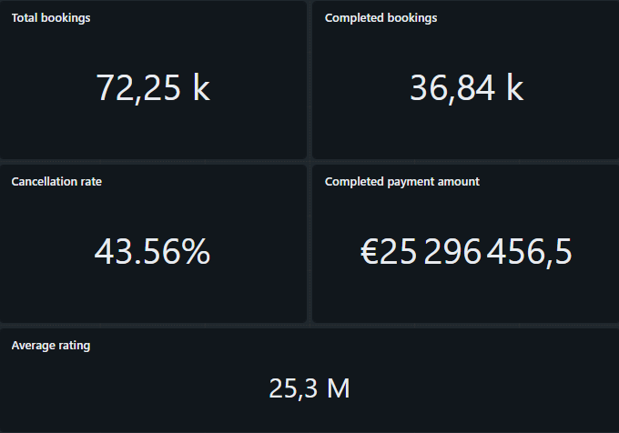
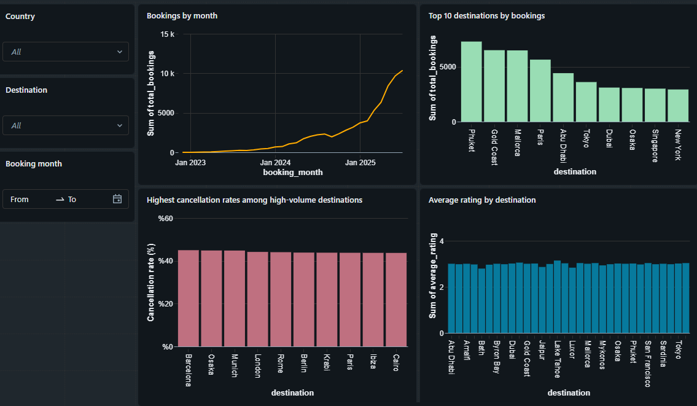
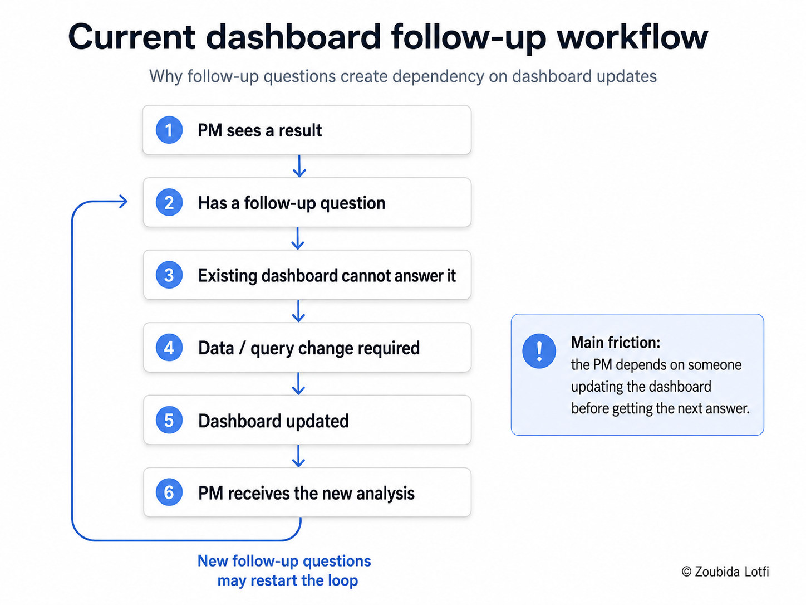

# Dashboard Baseline & Reference Experience

## Objective

Before testing Databricks Genie, I created a **dashboard baseline** to represent the current analytics experience available to a Product Manager.

The dashboard acts as a **reference point** for the teardown.

It helps answer a simple comparison question:

> Can Genie make business analysis more flexible without losing the consistency and trust provided by a predefined dashboard?

The dashboard is intentionally built around a fixed set of validated metrics and business questions.

---

## 1. Baseline scope

The dashboard focuses on the main Wanderbricks decisions defined earlier in the teardown.

It covers:

- Booking volume
- Completed and cancelled bookings
- Cancellation rate
- Completed payment amount
- Booking trends
- Destination performance
- Destination cancellation rates
- Customer ratings

It is not designed to answer every possible business question.

That limitation is intentional because it represents the traditional dashboard experience that Genie will later be compared against.

---

## 2. Dashboard evidence

### KPI overview

### Main dashboard

---

## 3. Core questions covered

| Business need | Dashboard answer |
| --- | --- |
| Understand overall demand | **72,247** total bookings |
| Track completed bookings | **36,835** completed bookings |
| Track cancellations | **28,428** cancelled bookings |
| Monitor cancellation performance | **43.56%** proposed cancellation rate |
| Monitor completed payments | Approximately **25.3M**, currency not available in the dataset |
| Compare destination demand | Phuket, Gold Coast, Mallorca, Paris, and Abu Dhabi are among the highest-volume destinations |
| Understand booking trends | Booking volume increases strongly across the available period |
| Compare cancellation performance | High-volume destinations have relatively similar cancellation rates |
| Compare customer satisfaction | Average ratings vary only slightly across destinations |

These results create the **known reference answers** that can later be compared with Genie.

---

## 4. What the baseline does well

The dashboard performs well when the business question is already known.

### Strengths

- **Fast access to recurring KPIs**
- **Consistent metric definitions**
- **Controlled calculations**
- **Simple visual monitoring**
- **Low user effort for common questions**

From a product perspective, the dashboard works well for:

> **Monitoring known questions repeatedly.**

A Product Manager can open the dashboard and quickly understand the metrics that were designed into it.

---

## 5. Where friction appears

The main limitation appears when the user moves from **monitoring** to **investigation**.

A Product Manager may see a change in the dashboard and immediately ask a new question, for example:

- Why did bookings increase during a specific month?
- Which property types have the highest cancellation rate?
- Which destinations combine high demand with low ratings?
- How do payment methods differ between countries?
- Are cancellations concentrated around specific check-in periods?

These questions are not part of the predefined dashboard.

### Current follow-up workflow

## 9. Definition of Done

The dashboard baseline phase is complete when:

- [x] The agreed Wanderbricks metrics are represented.
- [x] The dashboard uses the prepared data and semantic definitions.
- [x] The main recurring business questions can be answered.
- [x] KPI cards and core visualizations are available.
- [x] Filter behavior is understood and documented.
- [x] Known dashboard limitations are identified.
- [x] The dashboard provides reference answers for later Genie testing.
- [x] The main trade-off between consistency and flexibility is clear.

## 10. Decision Gate

**Decision: proceed to Genie Agent configuration and testing.**

The dashboard is stable enough to act as the baseline for the next phase.

The next step is to test whether Genie can:

- Answer the same core business questions correctly
- Handle new and follow-up questions
- Preserve the agreed metric definitions
- Reduce dependency on predefined dashboards
- Maintain enough transparency and trust for business use

### Product question for the next phase

> Can Genie add analytical flexibility without reducing reliability?
