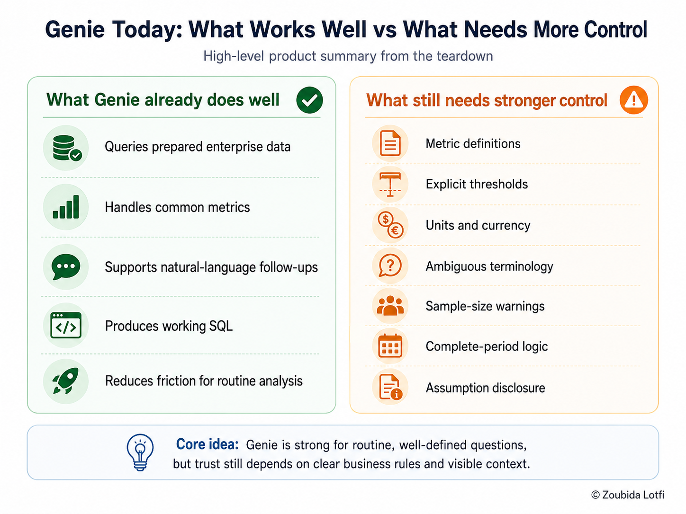

# Genie Quality Benchmark & Product Findings

## Objective

This phase tests whether the Wanderbricks Genie Agent is reliable enough for Product Managers to use for day-to-day business analysis.

The benchmark goes beyond checking whether SQL runs. It evaluates whether Genie:

- Returns the right result
- Preserves business definitions
- Handles ambiguity safely
- Makes assumptions visible
- Produces clear and usable answers

> **Benchmark goal:** measure whether Genie can provide flexible analytics without weakening trust in the underlying business meaning.

The detailed question-level evidence is documented in the [research file](../research/day-5-genie-quality-benchmark-research.md).

---

## 1. Evaluation design

The Agent was tested with **30 questions** across five types of analytics work:

| Area | What was tested |
| --- | --- |
| **Core metrics** | Bookings, cancellations, payments, and ratings |
| **Time and trends** | Date selection, monthly analysis, and complete periods |
| **Segmentation and ranking** | Destinations, countries, property types, and thresholds |
| **Data quality and ambiguity** | Currency, revenue, sample size, and unclear business terms |
| **Follow-up analysis** | Multi-step questions and combined metrics |

Each answer was evaluated against a trusted SQL reference.

The quality bar considered five dimensions:

- Numerical correctness
- SQL correctness
- Business-definition compliance
- Clarity
- Assumption handling

This makes the benchmark closer to a **product-quality evaluation** than a simple SQL test.

---

## 2. Headline results

| KPI | Result |
| --- | ---: |
| Questions tested | **30** |
| Average score | **7.87 / 10** |
| Reliable or acceptable | **25 / 30 (83.3%)** |
| Reliable | **15 (50.0%)** |
| Acceptable with minor issues | **10 (33.3%)** |
| Requires analyst review | **1 (3.3%)** |
| Failed | **4 (13.3%)** |
| Observed response time | **29–60 seconds** |

### Accuracy view

The gap between numerical correctness and definition compliance is the most important result.

> Genie often produced a plausible number even when it had changed the business meaning of the question.

---

## 3. Where Genie performed well

Genie was strongest when the question had:

- A clearly defined metric
- A known data source
- A direct aggregation or ranking
- Terminology already included in the Agent instructions
- Little need for business interpretation

The strongest category was **core metric accuracy**, with an average score of **9.00 / 10**.

This suggests that Genie performs well for structured, repeatable questions when the semantic rules are already clear.

---

## 4. Main reliability gaps

The benchmark exposed five recurring failure patterns.

| Reliability gap | Example | Product risk |
| --- | --- | --- |
| **Threshold drift** | A requested threshold of 1,000 was replaced with 10 | The Agent answers a different question while appearing confident |
| **Metric reinterpretation** | Completed payment amount was presented as revenue | Business meaning changes without approval |
| **Unsupported context** | Dollar symbols appeared although currency was unknown | The answer introduces information that does not exist in the data |
| **Period ambiguity** | The latest observed month was treated as complete | Trend analysis can use an incomplete period |
| **Small-sample risk** | A destination with 14 reviews ranked highest | A mathematically correct result can still be weak evidence |

Visualization quality also created some usability issues, especially when metrics with very different scales were shown together.

---

## 5. Product insight

The benchmark changed the core reliability question.

The main risk is not:

> **Can Genie generate SQL?**

The stronger question is:

> **Can Genie preserve the intended business meaning while generating SQL?**

The results show that these are different capabilities.

Genie generated executable SQL consistently, but some answers still failed because the Agent:

- Changed explicit thresholds
- Reinterpreted business terms
- Added unsupported currency
- Weakened assumptions
- Used weak comparison populations

### Key takeaway

> **Technical correctness is necessary, but semantic reliability determines whether the answer is safe to use.**

This becomes a central product requirement for business-facing AI analytics.

---

## 6. Reliability by question type

| Question type | Average | PM interpretation |
| --- | ---: | --- |
| **Core metrics** | **9.00 / 10** | Strong for known and governed questions |
| **Multi-step analysis** | **8.50 / 10** | Good when the requested logic is clear |
| **Data quality and ambiguity** | **7.50 / 10** | Useful, but trust issues remain |
| **Time and trends** | **7.17 / 10** | Needs clearer period rules |
| **Segmentation and ranking** | **7.17 / 10** | Most sensitive to thresholds and assumptions |

The performance pattern suggests that reliability falls as questions require more interpretation.

---

## 7. Product quality gap

The benchmark highlights a clear gap between **answer generation** and **answer trust**.

This is the area where configuration, governance, and product-level trust features become important.

---

## 8. Improvement priorities

The benchmark findings were translated into a small set of priorities for the next iteration.

### P0: Preserve explicit user constraints

Genie should never replace a user-provided threshold with its own value.

### P0: Protect governed business definitions

Terms such as **revenue** should only be used when an approved definition exists.

### P1: Make assumptions visible

If Genie must choose a threshold, period, or interpretation, that choice should be stated clearly.

### P1: Surface data limitations

Missing currency, small samples, and incomplete periods should be visible before the user acts on the answer.

### P2: Improve visualization relevance

Generated charts should show only the data needed to answer the question and should avoid misleading scale combinations.

This prioritization focuses first on problems that can change a business decision, rather than cosmetic issues.

---

## 9. Definition of Done

The benchmark phase is complete when:

- [x] A structured 30-question benchmark is completed.
- [x] Every question is compared with an independent trusted reference.
- [x] Numerical correctness and SQL correctness are evaluated separately.
- [x] Business-definition compliance is measured.
- [x] Ambiguity and assumption handling are included in the quality criteria.
- [x] Response time is observed.
- [x] The strongest use cases are identified.
- [x] Recurring failure patterns are documented.
- [x] Reliability gaps are translated into product priorities.
- [x] The questions that need improvement are identified for retesting.

---

## 10. Decision Gate

**Decision: proceed to targeted configuration improvement and retesting.**

The benchmark shows that Genie is already useful for clearly defined analytics questions, but semantic reliability is not strong enough to treat the first configuration as final.

The next iteration should focus specifically on the failure patterns found in this benchmark rather than changing the entire Agent.

### Success criteria for the next phase

The targeted retest should determine whether stronger instructions can:

- Preserve explicit thresholds
- Avoid unsupported currency
- Protect the definition of revenue
- Improve small-sample handling
- Handle complete periods more consistently
- Make assumptions clearer

### Product question for the next phase

> **Can targeted configuration changes improve semantic reliability without reducing Genie’s analytical flexibility?**
