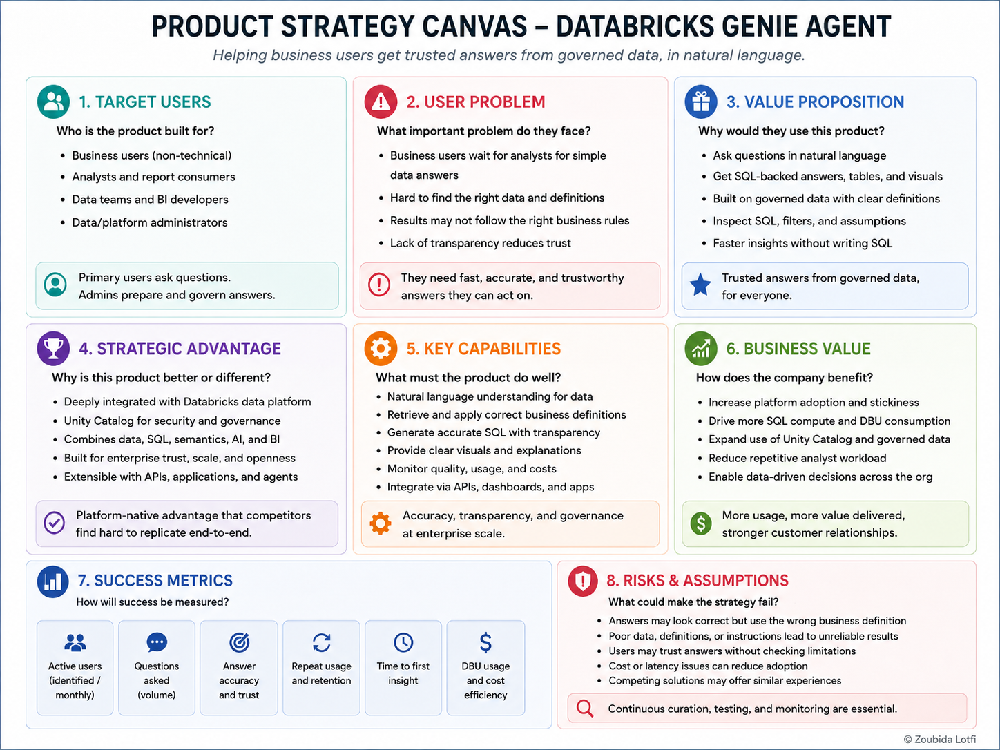
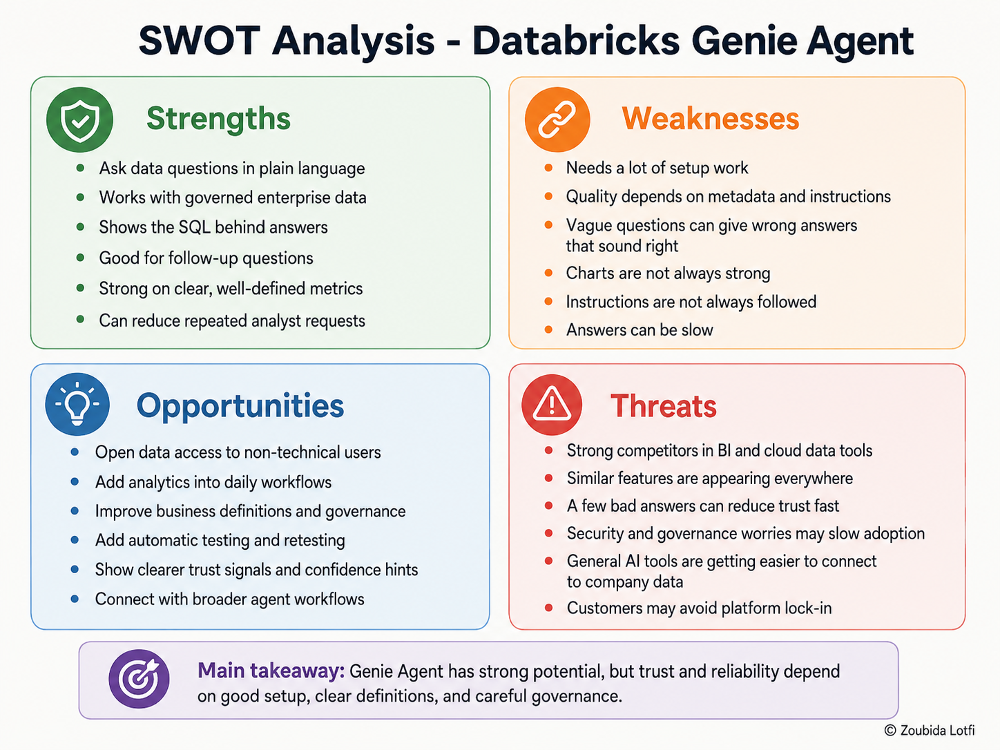

# Product Strategy & Opportunity Prioritization

## Objective

This phase explains **why Databricks offers Genie**, how it supports the wider Databricks platform, and which product opportunity is most important based on the teardown evidence.

The analysis combines:

- Official Databricks documentation
- Hands-on Genie testing
- The quality benchmark
- The targeted retest
- User-journey findings
- Competitive analysis

> **Strategy question:** Where does Genie create strategic value for Databricks, and where should the product improve to strengthen that value?

---

## 1. Strategic problem

Enterprise data is increasingly centralized in governed data platforms, but business users still depend on technical teams, dashboards, and predefined reports to answer many questions.

Genie addresses this gap by giving business users a natural-language layer on top of governed Databricks data.

### Strategic challenge

The challenge is not simply:

> **Can users ask questions in natural language?**

It is:

> **Can Databricks make governed business data easier to access without reducing reliability and trust?**

This is where Genie fits into the broader platform strategy.

---

## 2. Genie's role in the Databricks platform

| Strategic role | How Genie contributes | Evidence confidence |
| --- | --- | --- |
| **Activation** | Lets business users ask questions without writing SQL | **High** |
| **Expansion** | Creates more reasons to use governed Databricks data, SQL warehouses, dashboards, and agents | **High** |
| **Differentiation** | Combines conversational analytics with Unity Catalog, SQL, dashboards, apps, and agent workflows | **High** |
| **Monetization** | Genie usage and the SQL compute behind questions create platform consumption | **High** |
| **Ecosystem** | Extends Databricks data into dashboards, applications, APIs, and agent workflows | **High** |
| **Acquisition** | May make Databricks more attractive to non-technical business teams | **Medium, inferred** |
| **Retention** | May increase platform stickiness when Genie becomes part of recurring workflows | **Medium, inferred** |

### PM takeaway

Genie is more than a chat feature.

It acts as an **adoption layer** between governed Databricks data and business users.

Its value grows when it increases:

**Business access → platform usage → governed data consumption**

---

## 3. Product strategy canvas

The canvas summarizes:

- Target users
- User problem
- Value proposition
- Strategic role
- Key dependencies
- Main risks

---

## 4. What the teardown says about the strategy

| Strategic claim | Teardown evidence |
| --- | --- |
| **Natural language improves access** | Genie handled many direct business questions successfully |
| **Governance remains essential** | Only **18 of 30** original answers fully followed the intended business definitions |
| **Configuration can improve reliability** | The targeted subset improved from **5.73/10 to 7.91/10** |
| **Instructions are not enough** | Some questions remained weak or regressed after the update |
| **Transparency matters** | Generated SQL helped reveal when the Agent changed the intended business meaning |
| **Ambiguity is a product risk** | Revenue, high volume, best performance, complete periods, and other terms required interpretation |
| **Human review still has a role** | Executable SQL sometimes answered a different business question |

### Strategic implication

Genie's platform advantage is strongest when the underlying business meaning is already well governed.

Without that layer, easier access can also make incorrect interpretations easier to scale.

---

## 5. SWOT

---

## 6. Opportunity prioritization

The teardown identified several possible improvement areas.

| Opportunity | User impact | Evidence strength | Strategic fit | Priority |
| --- | --- | --- | --- | --- |
| **Improve decision confidence** | High | High | High | **P0** |
| **Reduce semantic and setup effort** | High | High | High | **P1** |
| **Strengthen automated regression testing** | Medium | High | High | **P1** |
| **Improve visualization quality** | Medium | Medium | Medium | **P2** |
| **Improve response speed** | Medium | Low | Medium | **P2** |

### Priority opportunity: decision confidence

The strongest opportunity is the gap between:

> **Genie produced an answer**

and

> **The business user understands why the answer is safe to use**

The benchmark, retest, user journey, and competitive analysis all point to the same problem:

- Definitions may be unclear
- Thresholds may change
- Assumptions may be hidden
- Sample sizes may be weak
- Currency or units may be missing
- A technically valid query may still use the wrong business meaning

This makes **decision confidence** the strongest opportunity to carry into solution design.

---

## 7. Strategic position

Genie is most compelling for organizations that already centralize data and governance in Databricks.

Its advantage is not natural-language querying alone.

Its strategic value comes from combining:

- Conversational access
- Governed enterprise data
- SQL
- Unity Catalog
- Dashboards
- Applications
- Agent workflows

The main strategic risk is **semantic reliability**.

If business users cannot easily understand the definitions, assumptions, and limitations behind an answer, the product may increase access without increasing confidence.

### Strategic direction

> **Move Genie from an assistant that can query governed data to an assistant that can consistently preserve and explain governed business meaning.**

---

## 8. Definition of Done

This product-strategy phase is complete when:

- [x] The strategic problem Genie addresses is defined.
- [x] Genie's role in the wider Databricks platform is clear.
- [x] Direct evidence is separated from strategic inference.
- [x] Benchmark findings are connected to product strategy.
- [x] Strengths, weaknesses, opportunities, and threats are summarized.
- [x] Product opportunities are prioritized.
- [x] Decision confidence is identified as the strongest opportunity.
- [x] The strategic direction is clear enough to move into solution design.

---

## 9. Decision Gate

**Decision: move forward with the Analytics Trust Center prototype.**

The teardown showed that Genie can return a correct-looking answer while still using the wrong business meaning.

The proposed **Analytics Trust Center** directly addresses this gap. Its role is to help business users quickly see when an answer may need extra attention, without forcing them to inspect SQL.

The next phase will define and prototype the **Analytics Trust Center** and test whether it makes risky Genie answers easier to review.

### Product question for the next phase

> **Can a lightweight Trust Center help users spot important risks before they trust, share, or act on a Genie answer?**
