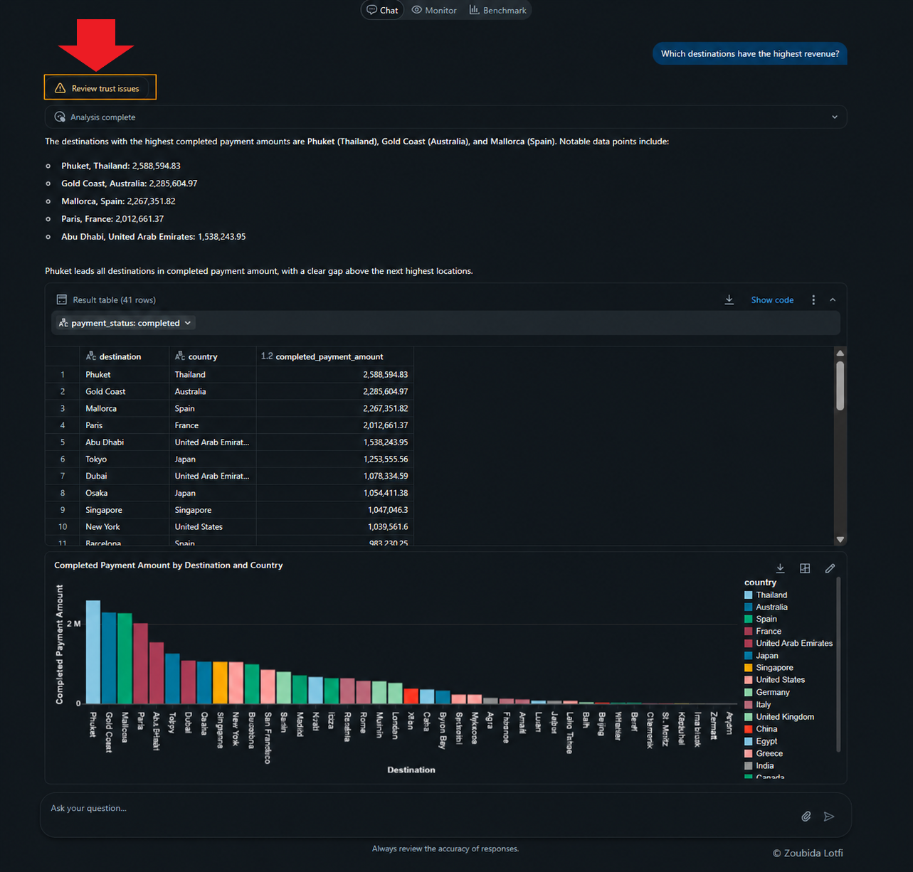
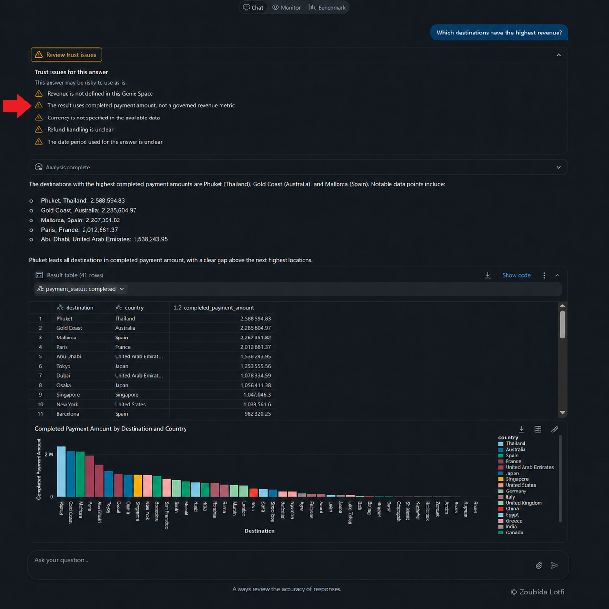

# Analytics Trust Center: Product Concept & Prototype

## Objective

Design a lightweight feature that helps business users decide whether a Genie answer is safe to trust, use, or share.

The concept is based on the main reliability problems found during the teardown:

- Correct-looking answers using the wrong business definition
- Hidden assumptions
- Changed thresholds
- Missing currency or date context
- Small sample sizes
- Incomplete periods
- Valid SQL that still answers the wrong business question

> **Product goal:** add trust context only when it is needed, without making normal Genie answers heavier.

---

## 1. Problem to solve

Improving data, definitions, examples, and Agent instructions should remain the first line of defense.

However, the retest showed that instructions do not guarantee consistent behavior.

This creates a gap between:

> **Genie generated an answer**

and

> **The user understands whether that answer is safe to use**

Existing tools such as **Analysis complete** and **Show code** help users inspect how Genie worked.

The proposed Trust Center focuses on a different question:

> **Did Genie apply the right business meaning to the question?**

---

## 2. Product hypothesis

> If Genie surfaces important semantic and context risks only when they are detected, business users can review risky answers more confidently without adding friction to normal questions.

### Main user

**Business user** reviewing a Genie answer before using, sharing, or acting on it.

### Secondary user

**Data administrator** investigating why an answer may be unreliable.

---

## 3. Design principles

The concept follows four simple principles:

### 1. Keep the normal experience clean

No extra Trust Center element appears when no issue is detected.

### 2. Show specific risks

Warnings should explain the actual problem, such as:

- Revenue is not defined
- Currency is missing
- Requested threshold was changed
- Sample size is too small

### 3. Support decisions, not just debugging

The goal is to help business users decide whether they should trust the answer.

### 4. Do not claim certainty

No warning does **not** mean the answer is guaranteed to be correct.

It only means that this trust layer did not detect a known issue.

---

## 4. Main user flow

.png)

The Trust Center is therefore an **exception layer**, not a permanent part of every answer.

---

## 5. Prototype screens

The prototype uses this benchmark question:

> **Which destinations have the highest revenue?**

This question is useful because several trust problems can appear at the same time:

- Revenue may not have an approved definition
- Completed payment amount may be used as a proxy
- Currency may be missing
- Refund treatment may be unclear
- The date period may be unclear

### Screen 1: Trust issue alert

The existing Genie answer stays unchanged.

One conditional element is added:

**Review trust issues**

The button appears only when Genie detects a possible business-definition or context problem.

### Screen 2: Trust Issues Review

After the user clicks the button, the Trust Center panel opens.

It shows the specific risks detected for that answer.

Example warnings:

- Revenue has no approved definition
- Completed payment amount was used as a proxy
- Currency is not specified
- Refund treatment is unclear
- Date period is unclear

---

## 6. Core components

| Component | Role |
| --- | --- |
| **Trust issue detection** | Detects a possible business-definition or context problem |
| **Review trust issues** | Appears only when a risk is detected |
| **Trust Issues Review panel** | Gives the user one place to review the risks |
| **Issue list** | Shows the exact problems found |
| **Issue explanation** | Explains briefly why each problem matters |

The concept intentionally stays small.

It does not create a second analytics workflow or replace the existing SQL inspection tools.

---

## 7. Trust-status model

The prototype uses only two states:

| State | Experience |
| --- | --- |
| **No trust issue detected** | Genie behaves normally. No extra Trust Center element appears. |
| **Trust issue detected** | **Review trust issues** appears and opens the Trust Issues Review panel. |

This keeps the interaction easy to understand and avoids adding unnecessary status labels.

---

## 8. Validation against benchmark failures

The concept was checked against real failures from the teardown.

| Failure type | Example | Would the Trust Center help? |
| --- | --- | --- |
| **Incomplete period** | Latest observed month treated as complete | **Yes** |
| **Changed threshold** | 1,000 bookings changed to 10 | **Yes** |
| **Changed review threshold** | 1,000 reviews changed to 10 | **Yes** |
| **Undefined revenue** | Completed payment amount presented as revenue | **Yes** |
| **Missing currency** | Dollar symbols shown without a currency field | **Yes** |
| **Small sample** | Highest rating based on 14 reviews | **Yes** |
| **Undefined high volume** | Genie selected its own threshold | **Yes** |
| **Wrong analytical population** | Averages calculated over the wrong destination population | **Yes** |
| **Trend wording issue** | Fluctuating trend described as consistently increasing | **Partially** |
| **Poor chart scale** | Different metric scales shown together | **No** |
| **Chart readability** | Small rating differences hard to see | **No** |

### Validation takeaway

The Trust Center fits best with **semantic and business-context risks**.

It is less useful for visual-design problems.

---

## 9. What the Trust Center should detect

### P0: Business-definition risks

- Undefined metric
- Wrong metric proxy
- Changed explicit threshold
- Wrong analytical population

### P1: Missing context

- Missing currency or units
- Incomplete date period
- Hidden assumption
- Small sample size

### P2: Answer-to-data mismatch

- Written conclusion does not match the underlying result

This prioritization keeps the feature focused on issues that can materially change a business decision.

---

## 10. What the Trust Center is not

The Trust Center is **not**:

- A guarantee that every answer is correct
- A replacement for governed metrics
- A replacement for Agent instructions
- A replacement for SQL inspection
- A chart-quality checker
- A substitute for analyst review on sensitive questions

It is an additional safety layer for business users.

---

## 11. Product value

### For business users

- Faster review of risky answers
- Less need to inspect SQL
- Better visibility into assumptions and definitions
- More confidence before sharing or acting

### For administrators

- Clearer signals about why an answer may be unsafe
- Easier diagnosis of semantic failures
- More visibility into recurring trust problems

### For Databricks

The concept supports the strategic direction identified earlier:

> **Make governed business meaning easier to understand, not only easier to query.**

---

## 12. Prototype success criteria

The prototype should be considered useful if it can:

- Make the main trust risk easy to notice
- Explain the issue in business language
- Avoid cluttering normal answers
- Help users decide whether an answer needs review
- Surface issues that were previously hidden behind valid SQL
- Work without requiring the user to understand SQL

---

## 13. Definition of Done

This prototype phase is complete when:

- [x] The trust problem is clearly defined.
- [x] The main user and secondary user are identified.
- [x] A simple product hypothesis is documented.
- [x] The Trust Center is positioned as an exception layer.
- [x] The two-state trust model is defined.
- [x] The main user flow is mapped.
- [x] Two prototype screens are designed.
- [x] Core components are defined.
- [x] The concept is checked against benchmark failures.
- [x] The limits of the concept are documented.
- [x] Success criteria are defined.

---

## 14. Decision Gate

**Decision: keep the Analytics Trust Center as the proposed product solution.**

The concept directly addresses the strongest opportunity found across the teardown:

> Business users can receive a plausible Genie answer without clearly seeing the definitions, assumptions, or limitations that affect whether it should be trusted.

The prototype is worth carrying into the final product recommendation because it:

- Targets a problem observed repeatedly in the benchmark
- Supports the user-journey need for better decision confidence
- Fits the competitive shift toward governance and transparency
- Builds on Genie's existing interface instead of replacing it
- Adds friction only when a trust issue is detected

### Final product question

> **Can the Analytics Trust Center improve decision confidence without making Genie slower or harder to use?**
