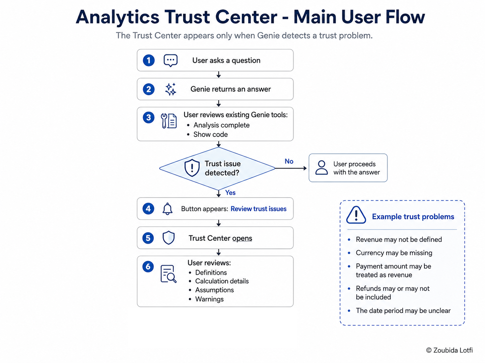

# Analytics Trust Center Prototype

## Goal

Design a prototype that helps business users decide whether they can trust Genie's answers enough to use them.

The prototype addresses the main problems found in the benchmark:

- Correct-looking answers using the wrong definition
- Hidden assumptions
- Changed thresholds
- Missing currency or date context
- Small sample sizes
- Incomplete periods
- SQL that runs but answers a different question

---

## 1. Why a Trust Center is needed

The first response to unreliable answers is to improve the Agent's data, definitions, examples, and instructions.

However, the retest showed that instructions are not always followed consistently. Some questions remained weak or regressed even after explicit rules were added.

This means configuration alone is not enough. Although users already have visibility into how the Agent interpreted the question and which rules it applied, the proposed **Analytics Trust Center** would act as an additional safety layer.

It would show definitions, assumptions, filters, thresholds, data coverage, sample size, and warnings before the user relies on the answer.

The proposed feature focuses on something the existing **Analysis complete** and **Show code** tools do not clearly solve:

> **Did Genie apply the right business meaning to the question?**

---

## 2. The Trust Center concept

The Trust Center button appears only when Genie detects a potential trust problem. A normal, well-defined question therefore does not add more UI clutter.

| Existing Genie feature | What it tells the user |
|---|---|
| **Analysis complete** | Which data, tables, fields, and reasoning steps were used |
| **Show code** | Which SQL query was executed |
| **Proposed Trust Center** | Whether the definitions, calculations, assumptions, and business context behind the answer are safe to trust |

| User type | Description |
|---|---|
| **Main user** | Business user reviewing a Genie answer before using or sharing it |
| **Secondary user** | Data administrator investigating incorrect or low-confidence answers |

---

## 3. Design of the main user flow

The main flow:

---

## 4. Design of the prototype screens

One benchmark question is used as the prototype example:

> **Which destinations have the highest revenue?**

This question exposes several trust problems:

- Revenue may not be defined
- Currency may be missing
- Payment amount may be treated as revenue
- Refunds may or may not be included
- The date period may be unclear

### Screen 1: Genie answer

One new element is added to the existing Genie interface:

| Added element | Description | Why it was added |
|---|---|---|
| **Review trust issues** button | A warning-style button placed above **Analysis complete** | It appears only when Genie detects a possible business-meaning problem that is not fully explained by the existing analysis or SQL view |

**Result:**

### Screen 2: Trust Issues Review

This screen shows the **Trust Center expanded after the user clicks Review trust issues**. The original Genie answer, Analysis complete section, table, chart, and Show code remain unchanged.

The new panel highlights business-level risks that may not be obvious from valid SQL alone, including an undefined revenue metric, use of completed payment amount as a substitute for revenue, missing currency, unclear refund treatment, and an unspecified date period.

Its purpose is to help the user understand **why the answer may be risky to use before making or sharing a decision**.

**Result:**

---

## 5. Core prototype components

| Component | Purpose |
|---|---|
| **Trust issue detection** | Detects when an answer may have a business-definition or context problem |
| **Review trust issues button** | Appears only when a trust issue is detected |
| **Trust Issues Review panel** | Opens after the user clicks the button |
| **Issue list** | Shows the specific risks found in that answer |
| **Issue explanation** | Briefly explains why each issue matters |

---

## 6. Trust-status model

| State | What happens |
|---|---|
| **No trust issue detected** | Genie behaves normally. No extra Trust Center element appears. |
| **Trust issue detected** | The **Review trust issues** button appears. Clicking it opens the Trust Issues Review panel. |

---

## 7. Validate the concept against benchmark failures

The Trust Center was compared against failures found in the benchmark to check whether it would have made those problems visible before a user acted on the answer.

| Benchmark question | Problem found | What the Trust Center would show | Would it help? |
|---|---|---|---|
| **Q12 - Compare booking volume in the latest three complete months.** | July 2025 was treated as complete even though it was the latest observed month. | `Warning: latest observed month may be incomplete` | **Yes** |
| **Q17 - Which destinations have the lowest cancellation rate among those with at least 1,000 bookings?** | Genie originally changed the threshold from **1,000 bookings to 10**. | `Requested threshold: 1,000 bookings` and `Applied threshold: 10 bookings` | **Yes** |
| **Q18 - Which destinations have the lowest average rating among those with at least 1,000 reviews?** | Genie originally changed the threshold from **1,000 reviews to 10**. | `Requested threshold: 1,000 reviews` and `Applied threshold: 10 reviews` | **Yes** |
| **Q19 - What is Wanderbricks revenue?** | Revenue was not defined, but Genie treated completed payment amount as revenue and assumed a currency. | `Revenue has no approved definition` and `Completed payment amount was used as a proxy` | **Yes** |
| **Q20 - What currency are completed payment amounts recorded in?** | No currency existed in the data, but the original answer still displayed dollar symbols and speculated about currencies. | `Currency is not defined in the available data` | **Yes** |
| **Q21 - Which destination has the highest average rating?** | Innsbruck ranked highest at 3.30, but this was based on only **14 reviews**. | `Small sample: 14 reviews` | **Yes** |
| **Q25 - Which destinations combine high booking volume with below-average ratings?** | The original answer used its own definition of high volume. After the retest, it applied **no high-volume threshold**. | `High volume has no approved definition` and show the threshold actually applied | **Yes** |
| **Q26 - Which destinations have both above-average cancellation rates and above-average payment amounts?** | The retest returned the correct destinations but calculated the averages using the wrong population. | Show the population used to calculate each average | **Yes** |
| **Q10 - How have completed payment amounts changed by payment month?** | Genie described a non-monotonic trend as consistently increasing and still used an unsupported dollar symbol after the retest. | Warn about unsupported currency and potentially flag a mismatch between the written conclusion and the underlying data | **Partially** |
| **Q27 - Compare Phuket and Gold Coast across bookings, cancellations, payments, and ratings.** | The calculations were correct, but the chart put metrics with very different scales together. | The Trust Center is not designed to fix chart design | **No** |
| **Q29 - Among the top ten destinations by bookings, which have the lowest ratings?** | The answer was correct, but the chart scale made small rating differences difficult to see. | The Trust Center is not designed to fix chart readability | **No** |

### What this validation shows

The strongest fit is with **semantic and business-context failures**:

- Undefined metrics
- Changed thresholds
- Missing units or currency
- Incomplete periods
- Small samples
- Wrong populations
- Hidden assumptions

The prototype is less suited to presentation problems such as poor chart selection.

> The Trust Center does not guarantee a correct answer. It adds a safety layer that makes important problems visible before the user trusts, shares, or acts on the result.
