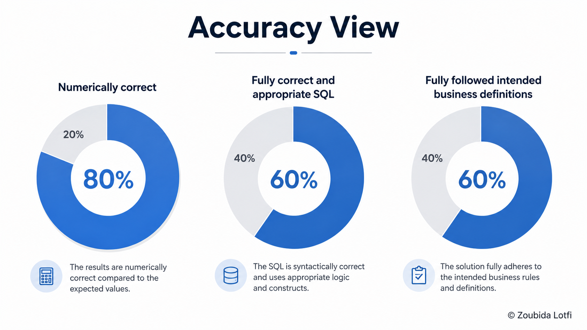
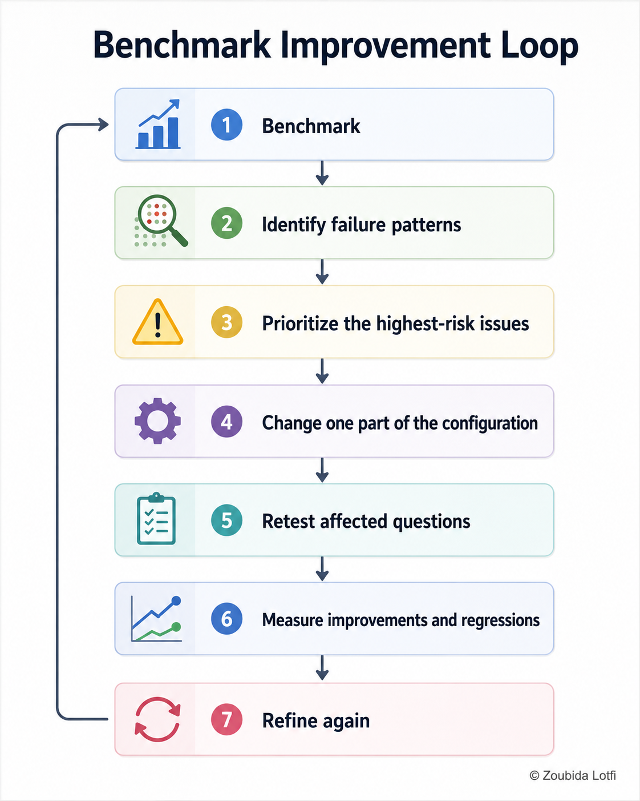
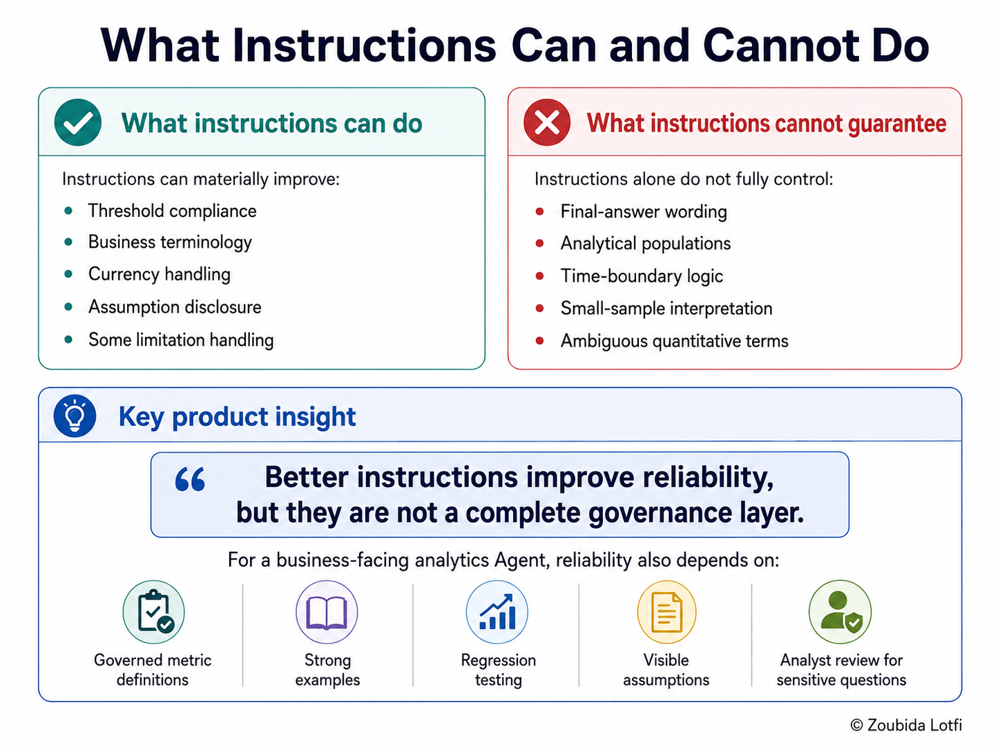
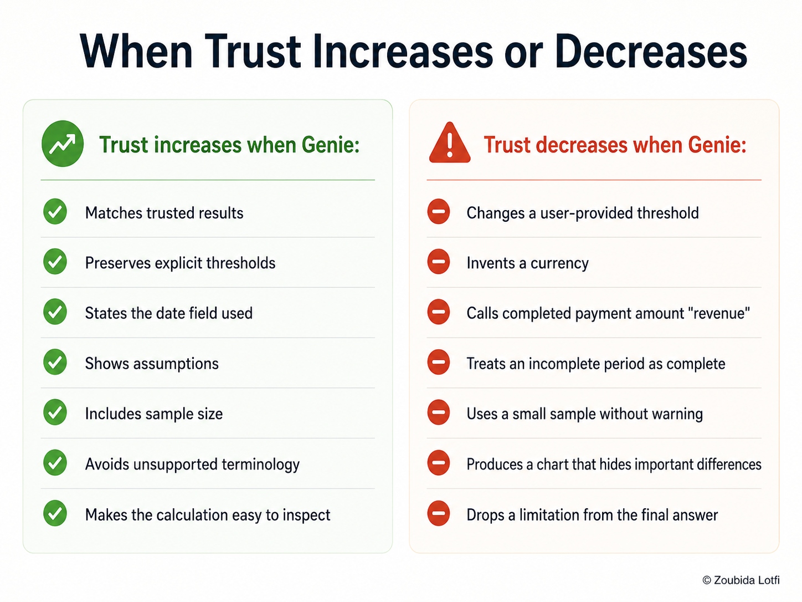
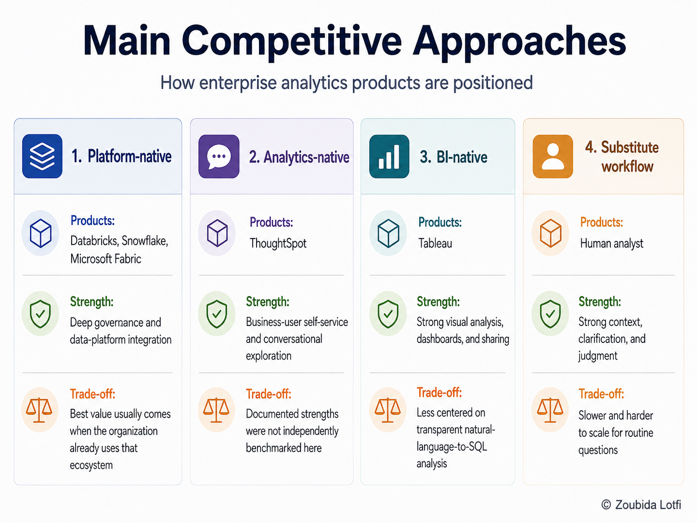

# Visual index

This page tells the teardown story through selected visuals. Supporting screenshots are linked rather than all embedded. For the ordered PM narrative, start with the [docs index](../docs/README.md).

## Product context

The business user asks a question while business context, governance, enterprise data, and the data team support answer generation. A duplicate JPG export is also available as [supporting format](genie-agent-architecture.jpg).

The starting workflow shows why dashboard follow-up questions can return to an analyst and restart the cycle. See [Product Discovery](../docs/01-product-discovery-and-scope.md).

## Data and semantic preparation

The six-table map explains why current booking state, payment attempts, geography, and reviews needed separate semantic treatment. See [Data Readiness](../docs/02-data-readiness-and-semantic-decisions.md).

## Dashboard baseline

The baseline handles recurring booking, destination, cancellation, and rating views with controlled calculations.

| Visual | What it shows |
| --- | --- |
| [KPI cards](kpi-cards.png) | Validated top-level booking, cancellation, payment, and rating measures. |
| [Dashboard follow-up workflow](current-dashboard-follow-up-workflow.png) | Where a new question can leave the predefined dashboard and require analyst support. |

See [Dashboard Baseline](../docs/03-dashboard-baseline.md).

## Genie setup and smoke testing

This setup capture shows the initial booking, cancellation, payment, review, status, and date guardrails provided to the Agent.

This selected answer shows a more interpretive question and the importance of an explicit population, review counts, and careful wording.

| Supporting evidence | What it shows |
| --- | --- |
| [Agent configuration examples](agent-2.png) | Example queries supplied during setup. |
| [Questions 1 to 4](agent-3.png), [Q2](agent-5.png), [Q3](agent-6.png), [Q4](agent-7.png) | Total bookings, completed bookings, cancellation rate, and top destination. |
| [Questions 5 and 6](agent-9.png), [Q6](agent-10.png) | Monthly bookings and completed payment amount by destination. |
| [Question 7](agent-11.png), [continued](agent-12.png) | Rating analysis and its visual output. |
| [Question 8](agent-13.png), [continued](agent-14.png) | High-volume destinations with below-average ratings. |
| [Unreferenced captures](agent-4.png), [agent-8.png](agent-8.png) | Additional workspace screenshots not cited by the smoke-test research narrative. |

See [Genie Readiness](../docs/04-genie-agent-readiness-and-smoke-test.md) and the [detailed setup evidence](../research/day-4-genie-agent-setup-and-smoke-test-research.md).

## Benchmark

This visual uses a strict binary view: 80% numerically correct, 60% fully appropriate SQL, and 60% fully compliant with definitions. The benchmark report separately scores each dimension from 0 to 2, producing 85%, 80%, and 73.3% of the maximum respectively. These are different summaries, not interchangeable metrics.

The evidence shows a strong fit for clear, routine questions and weaker control over definitions, thresholds, context, samples, periods, and assumptions. See the [Quality Benchmark](../docs/05-genie-quality-benchmark-and-product-findings.md).

## Configuration improvement and retest

The iteration changed targeted instructions, reran 11 affected questions, and measured both improvements and regressions.

Instructions improved several behaviors but did not guarantee final wording, analytical populations, time boundaries, or interpretation. See the [Targeted Retest](../docs/06-targeted-reliability-retest-and-product-learning.md).

## User journey and trust

Trust rose when definitions and context were preserved and fell when plausible answers hid changed meaning. See [User Journey, Trust, and Operating Model](../docs/07-user-journey-trust-and-operating-model.md).

## Competitive analysis

The visual groups platform-native, analytics-native, BI-native, and human-analyst approaches. Competitor findings came mainly from vendor documentation and were not independently benchmarked. See [Competitive Landscape](../docs/08-competitive-landscape-and-strategic-positioning.md).

## Product strategy

The canvas connects users, problem, value, platform advantage, capabilities, business value, possible metrics, and strategic risks.

The SWOT summarizes the opportunity to expand governed access and the risk that reliability depends on preparation, definitions, and control. See [Product Strategy](../docs/09-product-strategy-and-opportunity-prioritization.md).

## Analytics Trust Center prototype

**PROPOSED PRODUCT CONCEPT. This is not an existing Databricks feature and was not tested with real users.**

The proposal leaves the normal Genie experience unchanged unless a meaningful trust issue is detected, then offers a focused review step.

Screen 1 adds a visible **Review trust issues** entry point alongside the existing answer, analysis, and SQL experience.

Screen 2 exposes why the answer may be risky, including undefined revenue, a payment proxy, missing currency, unclear refunds, and an unclear period. See the [Analytics Trust Center document](../docs/10-analytics-trust-center-prototype.md).
