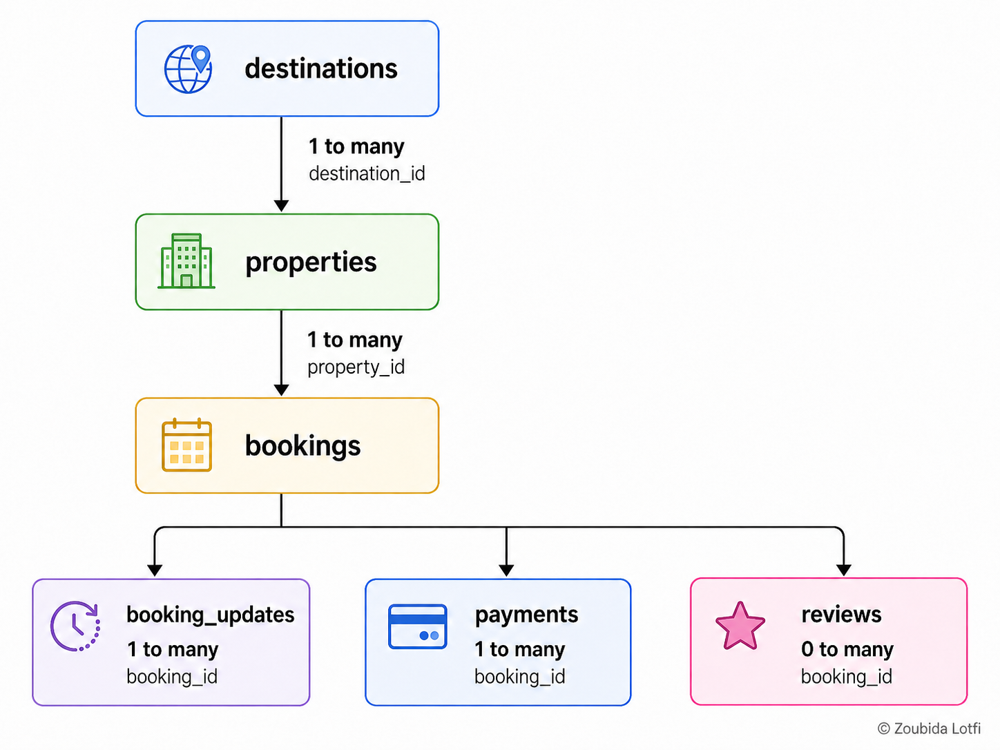

# Wanderbricks Data & Semantic Model Research

## Research purpose

This file contains the technical research behind the PM-facing data-readiness document.

It preserves the detailed table analysis, relationships, SQL, metric logic, data-quality findings, assumptions, and semantic decisions used to prepare Wanderbricks for the dashboard baseline and Databricks Genie Agent.

The goal is not to create a production-grade data model. The goal is to establish a clear and testable technical foundation for the teardown:

- Select the relevant tables
- Understand how the tables connect
- Define a small set of business metrics
- Identify important data-quality issues
- Document assumptions that may affect Genie answers

## Business scenario

> A manager at Wanderbricks wants to understand booking performance, cancellations, collected revenue, destinations, properties, and customer satisfaction without waiting for a data analyst.

## Scope

This semantic model focuses on:

- Booking volume
- Current booking status
- Completed and cancelled bookings
- Collected payment amount
- Destination and property performance
- Customer ratings

The following areas are outside the initial scope:

- Clickstream analysis
- Marketing attribution
- Support-ticket analysis
- Customer segmentation
- Machine-learning predictions
- Production-grade financial reconciliation

---

## 1. Selected tables

| Table | Grain | Primary key | Purpose |
| --- | --- | --- | --- |
| `bookings` | One row per original booking | `booking_id` | Provides the original booking record |
| `booking_updates` | One row per booking update | `booking_update_id` | Provides the latest known state of an updated booking |
| `properties` | One row per property | `property_id` | Provides property information and connects bookings to destinations |
| `destinations` | One row per destination | `destination_id` | Provides destination, country, and regional information |
| `payments` | One row per payment attempt | `payment_id` | Provides payment status and collected payment amount |
| `reviews` | One row per review | `review_id` | Provides customer ratings and written feedback |

These six tables are enough for the first version of the teardown.

---

## 2. Relationship map



Additional review relationships:

```text
reviews.property_id -> properties.property_id
reviews.booking_id  -> bookings.booking_id
reviews.user_id     -> users.user_id
```

### Proposed cardinalities

| Relationship | Proposed cardinality |
| --- | --- |
| One destination to properties | One-to-many |
| One property to bookings | One-to-many |
| One booking to booking updates | One-to-many |
| One booking to payment attempts | One-to-many |
| One booking to reviews | Zero-to-many |
| One property to reviews | One-to-many |

The relationship between bookings and reviews should be treated as zero-to-many because not every booking will have a review.

---

## 3. Table details

### 3.1 `bookings`

**Purpose:** Stores the original booking record.

**Grain:** One row per booking.

**Primary key:** `booking_id`

| Column | Meaning |
| --- | --- |
| `booking_id` | Unique booking identifier |
| `user_id` | User who made the booking |
| `property_id` | Property being booked |
| `check_in` | Check-in date |
| `check_out` | Check-out date |
| `guests_count` | Number of guests |
| `total_amount` | Total amount attached to the booking |
| `status` | Original or stored booking status |
| `created_at` | Booking creation timestamp |
| `updated_at` | Last update timestamp stored in the main table |

**Important limitation:** The `status` column in this table is not a reliable representation of the latest booking status. The latest row from `booking_updates` should be used when available.

---

### 3.2 `booking_updates`

**Purpose:** Stores changes made to bookings.

**Grain:** One row per booking update.

**Primary key:** `booking_update_id`

**Foreign key:** `booking_id`

| Column | Meaning |
| --- | --- |
| `booking_id` | Booking being updated |
| `booking_update_id` | Unique update identifier |
| `check_in` | Updated check-in date |
| `check_out` | Updated check-out date |
| `guests_count` | Updated number of guests |
| `property_id` | Property attached to the booking |
| `status` | Updated booking status |
| `total_amount` | Updated amount due |
| `updated_at` | Time the update was created |
| `user_id` | User who created or updated the booking |

### Observed structure

- 83,068 update rows
- 47,726 distinct bookings with updates
- Key update fields had no null values in the inspection query
- Some bookings have multiple updates

Because update rows are complete, the latest update row can replace the original booking values for updated bookings.

---

### 3.3 `properties`

**Purpose:** Describes Wanderbricks properties.

**Grain:** One row per property.

**Primary key:** `property_id`

**Foreign key:** `destination_id`

| Column | Meaning |
| --- | --- |
| `property_id` | Unique property identifier |
| `host_id` | Property host |
| `destination_id` | Destination connected to the property |
| `title` | Property listing title |
| `description` | Property description |
| `base_price` | Base booking price |
| `property_type` | House, apartment, or another type |
| `max_guests` | Maximum number of guests |
| `bedrooms` | Number of bedrooms |
| `bathrooms` | Number of bathrooms |
| `created_at` | Date the property was listed |

This table supports analysis by property, property type, and destination.

---

### 3.4 `destinations`

**Purpose:** Describes the locations where Wanderbricks properties are listed.

**Grain:** One row per destination.

**Primary key:** `destination_id`

| Column | Meaning |
| --- | --- |
| `destination_id` | Unique destination identifier |
| `destination` | Destination name |
| `country` | Country name |
| `state_or_province` | State, province, or region |
| `state_or_province_code` | Regional code |
| `description` | Detailed destination description |

This table supports destination and country-level comparisons.

---

### 3.5 `payments`

**Purpose:** Stores payment attempts for bookings.

**Grain:** One row per payment attempt.

**Primary key:** `payment_id`

**Foreign key:** `booking_id`

| Column | Meaning |
| --- | --- |
| `payment_id` | Unique payment identifier |
| `booking_id` | Booking connected to the payment |
| `amount` | Payment amount |
| `payment_method` | Credit card, PayPal, bank transfer, or another method |
| `status` | Payment status |
| `payment_date` | Payment timestamp |

### Observed structure

- 45,958 bookings have payment records
- 3,680 bookings have more than one payment attempt
- No booking has more than one completed payment
- The maximum number of payment attempts for one booking is two

This means payment retries exist, but summing completed payments should not double-count completed payment revenue in the inspected data.

---

### 3.6 `reviews`

**Purpose:** Stores customer ratings and review comments.

**Grain:** One row per review.

**Primary key:** `review_id`

| Column | Meaning |
| --- | --- |
| `review_id` | Unique review identifier |
| `booking_id` | Booking that was reviewed |
| `property_id` | Property that was reviewed |
| `user_id` | User who wrote the review |
| `rating` | Rating from 1.0 to 5.0 |
| `comment` | Written review |
| `is_deleted` | Whether the review was deleted |
| `created_at` | Review creation timestamp |
| `updated_at` | Review update timestamp |

Deleted reviews should be excluded from customer-satisfaction metrics.

---

## 4. Reconstructing the current booking state

The original `bookings.status` values were found to be stale.

### Original status distribution

| Status | Booking count |
| --- | ---: |
| Pending | 31,575 |
| Confirmed | 17,948 |
| Cancelled | 15,285 |
| Completed | 7,439 |
| **Total** | **72,247** |

A time check showed:

| Status | Percentage with checkout already passed |
| --- | ---: |
| Pending | 91.50% |
| Confirmed | 91.62% |
| Cancelled | 87.37% |
| Completed | 91.91% |

The high percentage of past pending and confirmed bookings shows that the main booking status is not current enough for analysis.

### Recommended logic

1. Find the latest `booking_updates` row for each booking.
2. Use that row as the current booking state.
3. Keep the original `bookings` row when a booking has no update.

```sql
WITH latest_updates AS (
    SELECT
        *,
        ROW_NUMBER() OVER (
            PARTITION BY booking_id
            ORDER BY updated_at DESC, booking_update_id DESC
        ) AS row_number
    FROM samples.wanderbricks.booking_updates
),

current_bookings AS (
    SELECT
        b.booking_id,
        COALESCE(u.user_id, b.user_id) AS user_id,
        COALESCE(u.property_id, b.property_id) AS property_id,
        COALESCE(u.check_in, b.check_in) AS check_in,
        COALESCE(u.check_out, b.check_out) AS check_out,
        COALESCE(u.guests_count, b.guests_count) AS guests_count,
        COALESCE(u.total_amount, b.total_amount) AS total_amount,
        COALESCE(u.status, b.status) AS current_status,
        b.created_at,
        COALESCE(u.updated_at, b.updated_at) AS latest_updated_at
    FROM samples.wanderbricks.bookings AS b
    LEFT JOIN latest_updates AS u
        ON b.booking_id = u.booking_id
        AND u.row_number = 1
)

SELECT *
FROM current_bookings;
```

### Reconstructed status distribution

| Current status | Booking count | Share |
| --- | ---: | ---: |
| Completed | 36,835 | 50.98% |
| Cancelled | 28,428 | 39.35% |
| Confirmed | 5,768 | 7.98% |
| Pending | 1,216 | 1.68% |
| **Total** | **72,247** | **100.00%** |

The reconstructed status distribution is more suitable for the teardown because it uses the latest known booking state.

---

## 5. Proposed metric registry

The metrics below are proposed for the teardown. They are not production-approved business definitions.

| Metric | Proposed definition | Source | Date field | Main limitation |
| --- | --- | --- | --- | --- |
| Total bookings | Count distinct `booking_id` in the reconstructed current-booking dataset | `bookings` + `booking_updates` | `created_at` | Depends on how duplicate or test bookings are handled |
| Completed bookings | Count bookings where `current_status = 'completed'` | Reconstructed current bookings | `check_out` or `created_at` | The reporting date must be chosen consistently |
| Cancellation rate | Cancelled bookings divided by completed plus cancelled bookings | Reconstructed current bookings | `check_in`, `check_out`, or `created_at` | The denominator is a proposed business rule |
| Collected payment amount | Sum `payments.amount` where `payments.status = 'completed'` | `payments` | `payment_date` | Refund and reversal logic has not been reviewed |
| Average rating | Average `reviews.rating` where `is_deleted = false` | `reviews` | `created_at` | Only customers who leave reviews are represented |

---

### 5.1 Total bookings

**Definition:** Number of distinct bookings.

**Formula:**

```text
COUNT(DISTINCT booking_id)
```

**Recommended source:** Reconstructed current-booking dataset.

**Suggested date:** `created_at` for booking creation trends.

---

### 5.2 Completed bookings

**Definition:** Number of bookings whose latest known status is completed.

**Formula:**

```text
COUNT(DISTINCT booking_id)
WHERE current_status = 'completed'
```

**Recommended source:** Reconstructed current-booking dataset.

**Suggested date:** `check_out` when measuring completed stays.

---

### 5.3 Cancellation rate

**Definition:** Percentage of terminal bookings that ended in cancellation.

**Proposed formula:**

```text
Cancelled bookings
--------------------------------
Completed bookings + Cancelled bookings
```

Using the reconstructed status counts:

```text
28,428 / (36,835 + 28,428) = 43.56%
```

Pending and confirmed bookings are excluded because they have not reached a final status.

**Limitation:** Another company could define cancellation rate using all created bookings. The selected denominator must be clearly explained to Genie.

---

### 5.4 Collected payment amount

**Definition:** Sum of completed payment amounts.

**Formula:**

```text
SUM(amount)
WHERE payment status = 'completed'
```

**Recommended source:** `payments`

**Recommended date:** `payment_date`

`bookings.total_amount` should be described as booking value or amount due, not collected revenue. Cancelled bookings can still contain a `total_amount`.

---

### 5.5 Average rating

**Definition:** Average rating from active reviews.

**Formula:**

```text
AVG(rating)
WHERE is_deleted = false
```

**Recommended source:** `reviews`

**Recommended date:** `created_at`

**Limitations:**

- Not every booking receives a review
- Ratings only represent users who chose to respond
- Deleted reviews must be excluded

---

## 6. Business terminology

| Business term | Technical meaning |
| --- | --- |
| Booking | One reservation identified by `booking_id` |
| Current booking state | Original booking values replaced by the latest update when an update exists |
| Terminal booking | A booking whose current status is `completed` or `cancelled` |
| Booking value | `total_amount` attached to a booking |
| Collected payment amount | Completed payment amount from `payments` |
| Property | Accommodation listed on Wanderbricks |
| Destination | Geographic location connected to a property |
| Customer satisfaction | Rating from a non-deleted review |
| Cancellation rate | Cancelled terminal bookings divided by all terminal bookings |

These definitions should be included in the Genie instructions or semantic context so that the agent does not confuse booking value with collected payment amount.

---

## 7. Data-quality findings

### 7.1 Booking status is stale in the main table

More than 91% of the original pending and confirmed bookings had checkout dates in the past.

**Impact:** Queries using only `bookings.status` would produce misleading results.

**Decision:** Reconstruct current status using the latest `booking_updates` record.

---

### 7.2 Booking updates are complete records

The inspected update columns had no null values.

**Impact:** The latest update row can be used directly without rebuilding each column from separate partial updates.

---

### 7.3 Payment retries exist

Some bookings have two payment attempts.

**Impact:** Counting payment rows is not the same as counting paying bookings.

**Decision:** Use completed payments and count distinct booking IDs when measuring paid bookings.

---

### 7.4 Completed payments were not duplicated

No booking had more than one completed payment in the inspection query.

**Impact:** Summing completed payment amounts should not duplicate completed payments in the observed sample.

---

### 7.5 Booking amount is not collected revenue

Cancelled bookings still contain `total_amount`.

**Impact:** Summing `bookings.total_amount` would overstate collected revenue.

**Decision:** Use completed payments as the proposed collected-revenue source.

---

### 7.6 Reviews are incomplete by nature

Not every booking will have a review.

**Impact:** Average rating reflects reviewers, not all customers.

**Decision:** Present average rating as a satisfaction indicator, not a complete population measure.

---

### 7.7 Amount columns use floating-point types

`bookings.total_amount`, `properties.base_price`, and payment amounts are stored using numeric types that may require rounding in reports.

**Impact:** Small decimal differences may appear in aggregated results.

**Decision:** Round displayed monetary results to two decimal places.

---

## 8. Assumptions

For this teardown, the following assumptions will be used:

1. The latest booking update represents the current booking state.
2. If no booking update exists, the original booking row is current.
3. `completed` and `cancelled` are terminal booking statuses.
4. Pending and confirmed bookings are excluded from the proposed cancellation-rate denominator.
5. A completed payment represents collected payment amount.
6. Deleted reviews are excluded from satisfaction metrics.
7. The teardown does not attempt production-grade refund, dispute, or accounting reconciliation.
8. The purpose is to test how clearly Genie handles business definitions, not to certify the dataset for financial reporting.

---

## 9. Open questions

These questions should remain visible during the teardown:

- What payment statuses exist besides `completed`?
- Are refunds or payment reversals stored elsewhere?
- What currency does `amount` use?
- Should cancellation rate use terminal bookings or all created bookings?
- Should booking trends use `created_at`, `check_in`, or `check_out`?
- Can one booking have more than one review?
- Should property performance use bookings, completed stays, collected payments, or all three?
- How should missing reviews affect customer-satisfaction comparisons?
- Should Genie expose when it uses reconstructed status rather than the original status?
- How clearly must the semantic layer distinguish booking value from collected payment amount?

---

## 10. Recommended Genie context

The Genie Agent should receive the following instructions:

- Use the latest booking update when calculating current booking status.
- Use the original booking row only when no update exists.
- Do not use `bookings.total_amount` as collected revenue.
- Use completed payment amounts for collected-payment metrics.
- Exclude deleted reviews from rating metrics.
- Exclude pending and confirmed bookings from the proposed terminal cancellation rate.
- State which date field is used in every time-based answer.
- Explain when a metric uses a proposed business definition.

These instructions are important because technically valid SQL can still produce the wrong business answer when definitions are unclear.

---

## 11. Example questions supported by the model

The selected model should support questions such as:

- How many bookings were created each month?
- How many bookings are currently completed, cancelled, confirmed, or pending?
- What is the proposed cancellation rate?
- Which destinations have the most completed bookings?
- Which properties generate the highest completed payment amount?
- Which destinations have high booking volume but low ratings?
- What is the average rating by property?
- Which property types receive the most bookings?
- How has collected payment amount changed over time?
- Which destinations should a manager investigate because of high cancellations?

---

## 12. Research summary

The Wanderbricks teardown will use six core tables:

- `bookings`
- `booking_updates`
- `properties`
- `destinations`
- `payments`
- `reviews`

The most important finding is that the original booking status is stale. Current booking state must be reconstructed using the latest booking update.

The initial semantic model defines five proposed metrics:

- Total bookings
- Completed bookings
- Cancellation rate
- Collected payment amount
- Average rating

These definitions are sufficient for a beginner-friendly teardown. They are intentionally limited and should not be presented as production-approved financial or operational rules.

## Technical handoff

The data and semantic research is ready to support the next product phase.

Reusable SQL logic should be maintained in:

```text
sql/01-core-business-metrics.sql
```

The PM-facing decision is to proceed to the **dashboard baseline**, using the metric definitions, reconstructed booking state, assumptions, and data-quality decisions documented here.
