# Genie Agent Setup & Smoke Test Research

## Purpose

This file contains the detailed setup evidence and smoke-test results behind the PM-facing Genie readiness document.

It preserves the configuration choices, business instructions, example queries, screenshots, question-level results, and issues identified before the formal benchmark.

---

## 1. Agent setup

In Databricks:

```text
Genie Agents → New
```

Agent name:

```text
Wanderbricks Business Performance Agent
```

Description:

> Helps Wanderbricks managers explore booking performance, cancellations, completed payment amounts, destinations, properties, and customer ratings.

### Curated data sources

```text
workspace.wanderbricks_teardown.booking_analysis
workspace.wanderbricks_teardown.payment_analysis
workspace.wanderbricks_teardown.review_analysis
```

| View | Purpose |
| --- | --- |
| `booking_analysis` | Current booking status, booking dates, booking value, property, destination, and country |
| `payment_analysis` | Payment attempts, completed payment amounts, property, destination, and country |
| `review_analysis` | Active reviews, ratings, property, destination, and country |

These views were selected instead of the raw Wanderbricks tables because they already contain the main joins, filters, and current-booking logic required for analysis.

Using a small number of documented views reduces ambiguity and makes it less likely that the Agent will create incorrect joins or use outdated booking status values.

### Configuration evidence

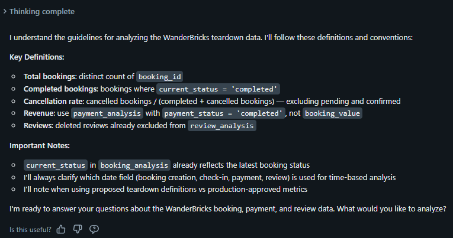

---

## 2. Business instructions

The following rules were added to the Agent configuration:

```text
Use booking_analysis as the source for current booking status.

The current_status column already contains the latest known booking status.

Define total bookings as the distinct count of booking_id.

Define completed bookings as bookings where current_status = 'completed'.

Define cancellation rate as:

cancelled bookings /
(completed bookings + cancelled bookings)

Exclude pending and confirmed bookings from the cancellation-rate denominator.

Use payment_analysis for completed payment amounts.

Only include payments where payment_status = 'completed'.

Do not describe booking_value as collected revenue.

Use review_analysis for customer ratings.

Deleted reviews have already been excluded.

When answering a time-based question, state whether the analysis uses booking creation date, check-in date, checkout date, payment date, or review date.

Mention when a metric uses a proposed teardown definition rather than a production-approved business definition.
```

These instructions were intended to provide stable business rules across conversations.

---

## 3. Example SQL patterns

Six example question-and-SQL patterns were added:

1. How many bookings are there?
2. What is the current booking-status distribution?
3. What is the cancellation rate?
4. Which destinations have the most bookings?
5. What is the completed payment amount by destination?
6. What is the average rating by destination?

The examples use the validated logic from:

```text
sql/01-core-business-metrics.sql
```

They reference the three persistent analysis views rather than the temporary `current_bookings` view.

### Example-query evidence

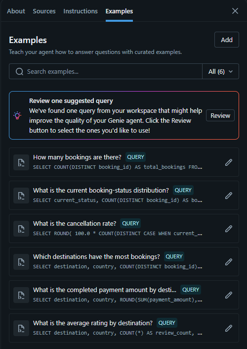

> [!NOTE]
> Example queries are part of the Agent configuration. They help the Agent generate SQL for similar questions. Benchmark questions remain separate because they are used to evaluate the Agent rather than teach it.

---

## 4. Smoke-test questions

Eight basic questions were asked to confirm that the Agent functions and understands the main definitions.

### Question 1: How many total bookings are there?

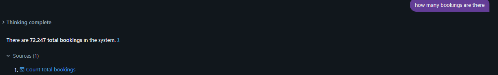

### Question 2: How many bookings are completed?

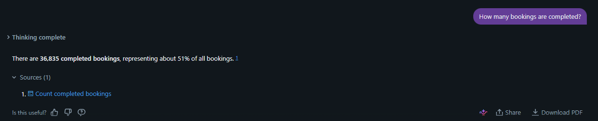

### Question 3: What is the cancellation rate?

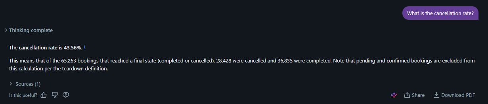

### Question 4: Which destination has the most bookings?

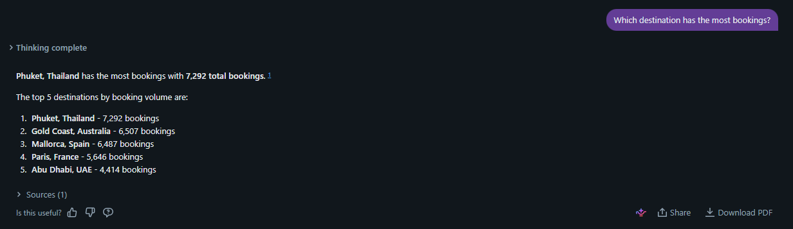

### Question 5: Show bookings by month

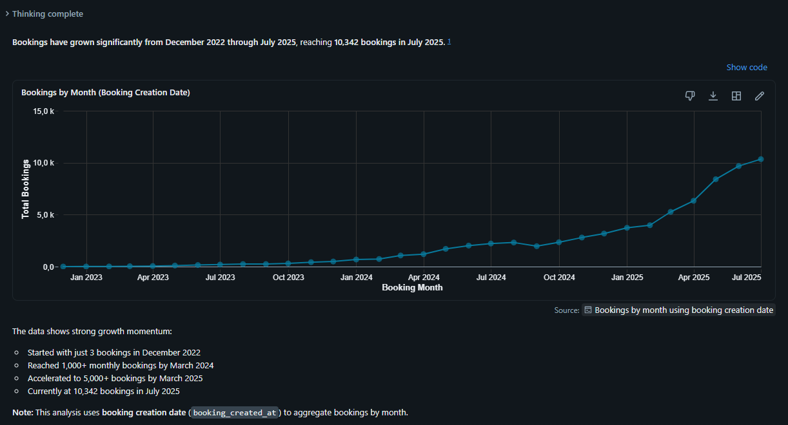

### Question 6: Which destinations have the highest completed payment amount?

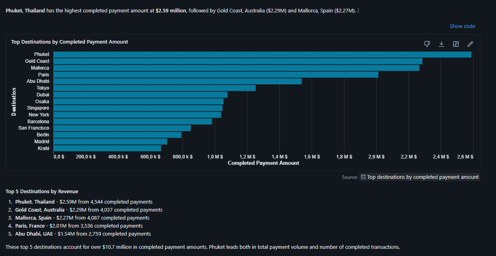

### Question 7: What is the average rating by destination?

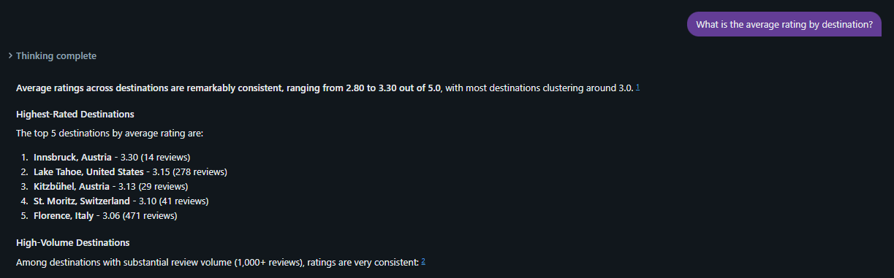

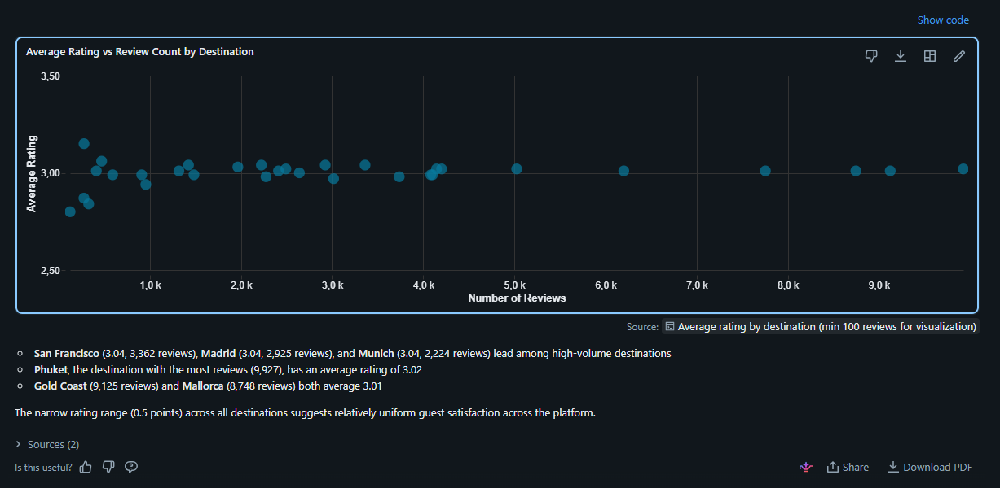

### Question 8: Which high-volume destinations have below-average ratings?

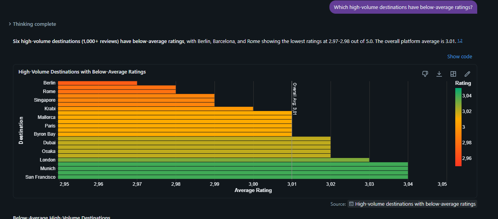

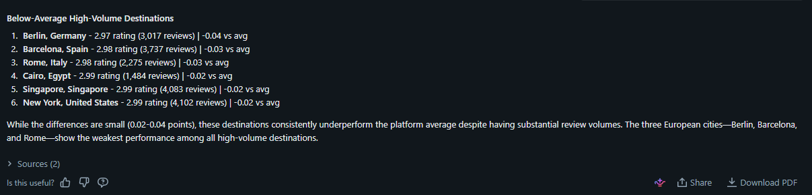

---

## 5. Question-level findings

| # | Question | Agent result | SQL/code available? | Finding |
| --- | --- | --- | --- | --- |
| 1 | How many total bookings are there? | **72,247 total bookings** | Not expanded in screenshot | Correct. Matches the validated total from `booking_analysis`. |
| 2 | How many bookings are completed? | **36,835 completed bookings**, approximately 51% of total bookings | Not expanded in screenshot | Correct. Matches the validated current booking state. |
| 3 | What is the cancellation rate? | **43.56%**, based on 28,428 cancelled and 36,835 completed bookings | Not expanded in screenshot | Correct. Pending and confirmed bookings were excluded. |
| 4 | Which destination has the most bookings? | **Phuket, Thailand with 7,292 bookings** | Not expanded in screenshot | Correct. The Agent also returned the next four destinations. |
| 5 | Show bookings by month | Monthly trend from December 2022 to July 2025, reaching **10,342 bookings in July 2025** | Yes | Correct. The Agent stated that `booking_created_at` was used. |
| 6 | Which destinations have the highest completed payment amount? | Phuket ranked first at approximately **2.59M**, followed by Gold Coast and Mallorca | Yes | Ranking appears correct, but the response added `$` and later called the metric revenue. |
| 7 | What is the average rating by destination? | Ratings ranged from **2.80 to 3.30**, with most close to 3.0 | Yes | Calculation appears correct, but very low-volume destinations appeared in the ranking. |
| 8 | Which high-volume destinations have below-average ratings? | Six destinations with at least 1,000 reviews were identified | Yes | Written answer addressed the question, but the threshold was Agent-defined and the chart included extra destinations. |

---

## 6. Smoke-test summary

| Check | Result |
| --- | --- |
| Questions answered | 8 of 8 |
| Total booking definition understood | Yes |
| Current booking state used | Yes |
| Completed booking definition followed | Yes |
| Cancellation-rate definition followed | Yes |
| Pending and confirmed excluded from cancellation denominator | Yes |
| Booking month date field identified | Yes, booking creation date |
| Completed payments filtered correctly | Appears to be yes |
| Deleted reviews excluded | Appears to be yes through `review_analysis` |
| Review volume considered | Partially |
| Immediate reliability concerns | Currency assumption, use of “revenue,” and low-volume rating comparisons |

---

## 7. Issues identified

### 7.1 Unsupported currency assumption

The completed payment response displayed dollar symbols even though the sample data does not identify a currency.

The Agent should use:

```text
Completed payment amount
```

It should not automatically display:

```text
$
€
USD
EUR
```

unless currency is explicitly available in the data or documented as an assumption.

### 7.2 Completed payment amount described as revenue

The Agent used the word **revenue**.

For this teardown, the safer term is:

```text
Completed payment amount
```

The dataset has not been validated against accounting rules, refunds, taxes, fees, or recognized-revenue policies.

### 7.3 Rating rankings based on small samples

Examples included:

- Innsbruck with 14 reviews
- Kitzbühel with 29 reviews
- St. Moritz with 41 reviews

These values may be mathematically correct but are weak comparisons against destinations with thousands of reviews.

Future comparisons should either:

- Apply a minimum review-count threshold, or
- Display the review count and warn about small samples.

### 7.4 Ambiguous definition of high volume

For the final smoke-test question, the Agent interpreted high volume as:

```text
At least 1,000 reviews
```

This was a reasonable assumption, but it was not defined in the original question.

The Agent should state the threshold whenever it introduces one.

### 7.5 Visualization included extra destinations

The written answer correctly identified six below-average destinations.

The generated chart also displayed above-average destinations, so the visualization did not exactly match the written answer.

---

## 8. Configuration refinements before benchmarking

The following instructions were identified for strengthening:

```text
Do not assign a currency symbol unless a currency field or documented currency definition is available.

Use the term completed payment amount. Do not call it revenue unless a production-approved revenue definition is available.

When ranking destinations by average rating, include review_count and warn when a result is based on a small number of reviews.

When the user asks for high-volume destinations without defining high volume, state the threshold used.

When generating a visualization, include only the records needed to answer the question.
```

These are configuration refinements, not benchmark results.

---

## 9. Research conclusion

The Genie Agent answered all eight smoke-test questions and applied the main booking definitions successfully.

The smoke test also showed that technically correct SQL is not sufficient for a fully reliable business answer. Wording, assumptions, sample size, units, and visualization scope can introduce risk even when the underlying calculation is correct.

The Agent was therefore considered functional enough to proceed to the formal benchmark.
